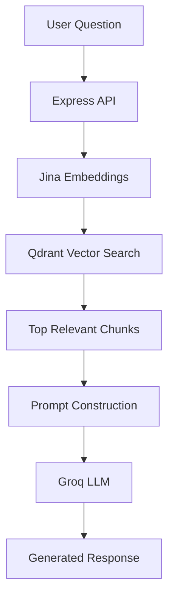
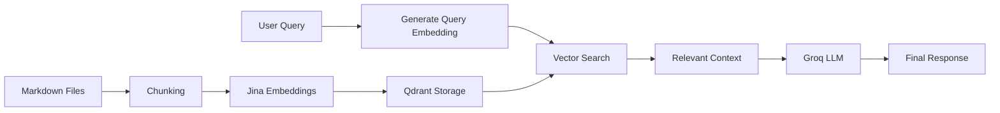

# 🤖 Portfolio AI Assistant

> An intelligent RAG-powered portfolio assistant built with **Node.js**, **Express**, **Qdrant**, **Jina AI Embeddings**, and **Groq**.

The assistant acts as a personal AI companion capable of answering questions about projects, skills, experience, achievements, and technical expertise by retrieving relevant information from a custom knowledge base before generating responses.

---

## ✨ Features

* 🔍 Retrieval-Augmented Generation (RAG)
* 🧠 Semantic Search
* 📚 Markdown-based Knowledge Base
* 🚀 Jina Embeddings for Vector Generation
* ⚡ Groq LLM for Fast Inference
* 🗄️ Qdrant Vector Database
* 🛡️ Centralized Error Handling
* 📂 Modular Backend Architecture
* 🎯 Context-Aware Responses
* 📈 Easily Extendable Knowledge Sources

---

## 🏗️ System Architecture



---

## 🔄 RAG Pipeline



---

## 🚀 Tech Stack

### Backend

* Node.js
* Express.js

### AI

* Jina AI Embeddings
* Groq LLM

### Vector Database

* Qdrant

### Knowledge Base

* Markdown Files

### Deployment

* Render
* Railway

---

## 📂 Project Structure

```text
portfolio-ai/

├── src/
│
├── controllers/
│   └── chat.controller.js
│
├── routes/
│   └── chat.route.js
│
├── middleware/
│   └── error.middleware.js
│
├── db/
│   └── qdrantDb.js
│
├── services/
│   ├── chunking.js
│   ├── embedding.js
│   └── qdrant.js
│
├── utils/
│   ├── ApiError.js
│   └── asyncHandler.js
│
├── knowledge/
│   ├── about.md
│   ├── contact.md
│   ├── experience.md
│   ├── achievement.md
│   ├── skills.md
│   ├── videoTube.project.md
│   ├── orgmemory.project.md
│   └── projectManagement.project.md
│
├── app.js
├── index.js
├── package.json
├── .env
└── README.md
```

---

## 📚 Knowledge Sources

The assistant retrieves information from markdown documents.

Example:

```text
knowledge/

about.md
contact.md
experience.md
achievement.md
skills.md

videoTube.project.md
orgmemory.project.md
projectManagement.project.md
```

This makes the assistant easy to maintain and extend without modifying application logic.

---

## ⚙️ How It Works

### Step 1 — Knowledge Ingestion

Portfolio documents are loaded from the knowledge directory.

```text
Markdown Files
      ↓
Text Extraction
```

---

### Step 2 — Chunking

Large documents are split into smaller chunks.

```text
Document
    ↓
Chunk 1
Chunk 2
Chunk 3
```

Chunking improves retrieval precision.

---

### Step 3 — Embedding Generation

Each chunk is converted into a vector representation using Jina Embeddings.

```text
Chunk
  ↓
Embedding Model
  ↓
Vector
```

---

### Step 4 — Vector Storage

Embeddings are stored inside Qdrant.

```text
Vector
  ↓
Qdrant Collection
```

---

### Step 5 — Query Retrieval

When a user asks a question:

```text
Tell me about VideoTube
```

The query is embedded and matched against stored vectors.

Qdrant returns the most relevant chunks.

---

### Step 6 — Response Generation

Retrieved chunks are injected into the LLM prompt.

```text
Context
   +
Question
   ↓
Groq LLM
   ↓
Answer
```

This significantly reduces hallucinations and keeps answers grounded in portfolio knowledge.

---

## 🔐 Environment Variables

Create a `.env` file:

```env
PORT=8000

QDRANT_URL=
QDRANT_API_KEY=

JINA_API_KEY=

GROQ_API_KEY=
```

---

## 📦 Installation

Clone the repository:

```bash
git clone https://github.com/git-aftab/portfolio-ai-assistant.git

cd portfolio-ai-assistant
```

Install dependencies:

```bash
npm install
```

Start development server:

```bash
npm run dev
```

---

## 🌐 API Endpoints

### Chat Endpoint

```http
POST /api/chat
```

Request:

```json
{
  "message": "Tell me about VideoTube"
}
```

Response:

```json
{
  "success": true,
  "response": "VideoTube is a scalable YouTube-inspired backend..."
}
```

---

## 🛡️ Error Handling

The application uses:

* Custom Error Classes
* Centralized Error Middleware
* Async Handler Wrapper
* Graceful Failure Responses

This ensures a stable user experience even when external services fail.

---

## 🎯 Why RAG?

Traditional chatbots rely solely on model knowledge.

This project uses Retrieval-Augmented Generation to:

* Reduce hallucinations
* Increase factual accuracy
* Keep responses grounded in portfolio data
* Enable easy content updates without retraining

---

## 🚀 Future Improvements

* Streaming Responses
* Source Citations
* Conversation Memory
* Multi-Collection Retrieval
* Visitor Analytics
* Resume Download Actions
* Project Cards
* Admin Dashboard
* Hybrid Search
* Agentic Workflows

---

## 💡 What This Project Demonstrates

This project showcases practical implementation of:

* Retrieval-Augmented Generation (RAG)
* Vector Databases
* Semantic Search
* Prompt Engineering
* AI Application Architecture
* Backend Development
* API Design
* Error Handling Patterns
* Production-Oriented Engineering

---

## 👨‍💻 Author

### Md Aftab Ansari

Backend Developer • AI Enthusiast • System Builder

* GitHub: https://github.com/git-aftab
* Portfolio: https://www.mdaftab.me

---

## ⭐ Support

If you found this project useful, consider giving it a star.

It helps others discover the project and motivates future improvements.
